# NEUROMORPHIC 2.0

An interactive technology demonstrator that simulates on-board, brain-inspired image filtering for satellite and edge-imaging systems. The application models how a neuromorphic processor can reject cloud-covered or low-value imagery before transmission, reducing power draw, storage usage, and bandwidth consumption.

This project is built as a front-end demo using React, Vite, TypeScript, and Tailwind CSS. It is intended for concept presentation, technical storytelling, and simulation-based exploration rather than as a deployed hardware system.

## Overview

Traditional satellite and remote-sensing pipelines often transmit every captured frame, even when clouds, haze, or empty scenes make the image unusable. NEUROMORPHIC 2.0 demonstrates a smarter approach:

- analyze images on-board in near-real time
- classify whether the frame is useful or should be rejected
- save bandwidth and mission energy by discarding low-value data locally
- support multiple mission profiles for different deployment contexts

## Why This Project Matters

The idea behind this project is to model how neuromorphic computing can enable:

- low-power edge AI for satellites, drones, and autonomous sensors
- targeted downlink only for usable imagery
- reduced mission cost and latency
- better resilience in low-connectivity environments

This is especially valuable in applications such as:

- earth observation
- defense and reconnaissance
- disaster response
- rural or remote sensing networks
- precision agriculture

## Key Features

- interactive image upload and sample-image analyzer
- real browser-based pixel heuristic cloud detection
- mission-specific filtering logic for six operational modes
- data savings and power comparison simulator
- architecture explanation section with visual flow design
- responsive UI built for modern web presentation

## Mission Modes Included

The demo supports the following use cases:

- Army / surveillance
- Navy / maritime monitoring
- Air Force / reconnaissance
- Satellite / orbital earth observation
- Rural / agricultural monitoring
- Disaster / emergency response

Each mode adjusts the cloud threshold and contextual assumptions for the filtering simulation.

## Architecture

```mermaid
flowchart LR
    A[Remote Sensor / EO Camera] --> B[Image Acquisition]
    B --> C[Preprocessing<br/>Resize / Normalize / Pixel Sampling]
    C --> D[Neuromorphic Edge Processor]
    D --> E[Feature Extraction<br/>Brightness / Saturation / Edge Density]
    E --> F{Cloud / Usability Decision}

    F -->|KEEP| G[Local Storage Buffer]
    F -->|REJECT| H[Discard Frame<br/>Save Power + Bandwidth]

    G --> I[Priority Queue / Downlink Scheduler]
    I --> J[Ground Station / Mission Control]
    J --> K[Human Operator / Analytics Pipeline]

    M[Mission Profile<br/>Army / Navy / Air / Satellite / Rural / Disaster] --> D
    N[Power Budget / Latency Constraints] --> D
    O[Image Metadata / Sensor Context] --> E

    D -. feedback .-> M
    G -->|Useful imagery only| J
    H -. no transmission .-> J

    classDef sensor fill:#0ea5e9,stroke:#7dd3fc,color:#ecfeff,stroke-width:1.5px;
    classDef process fill:#14b8a6,stroke:#5eead4,color:#ecfeff,stroke-width:1.5px;
    classDef decision fill:#f59e0b,stroke:#fcd34d,color:#fff7ed,stroke-width:1.5px;
    classDef storage fill:#22c55e,stroke:#86efac,color:#f0fdf4,stroke-width:1.5px;
    classDef output fill:#8b5cf6,stroke:#c4b5fd,color:#f5f3ff,stroke-width:1.5px;

    class A,B sensor;
    class C,D,E process;
    class F decision;
    class G,H,I storage;
    class J,K output;
    class M,N,O output;
```



## System Flow

1. A sensor captures an image.
2. Preprocessing resizes and normalizes the image.
3. A heuristic cloud-detection workflow evaluates brightness, whiteness, saturation, and edge characteristics.
4. The system decides whether the image should be kept or rejected.
5. Only valuable frames are stored or transmitted.
6. Bandwidth, storage, and energy are reduced compared with transmitting every frame.

## Tech Stack

- React
- TypeScript
- Vite
- Tailwind CSS
- Lucide React icons
- browser-based canvas image analysis

## Repository Structure

```text
CHIP/
├── src/
│   ├── App.tsx
│   ├── data.ts
│   ├── types.ts
│   ├── components/
│   │   ├── Architecture.tsx
│   │   ├── Counter.tsx
│   │   ├── DataSavings.tsx
│   │   ├── Hero.tsx
│   │   ├── ImageSimulator.tsx
│   │   ├── ImpactRoadmap.tsx
│   │   ├── Navbar.tsx
│   │   ├── OneChipModule.tsx
│   │   └── useInView.ts
│   ├── lib/
│   │   ├── imageAnalysis.ts
│   │   └── settings.ts
│   ├── index.css
│   └── main.tsx
├── CHIP.PY
├── eslint.config.js
├── index.html
├── package.json
├── postcss.config.js
├── README.md
├── tailwind.config.js
├── tsconfig.json
├── tsconfig.app.json
├── tsconfig.node.json
├── vite.config.ts
└── package-lock.json
```

## Getting Started

### Prerequisites

- Node.js 18+
- npm

### Install and run

```bash
npm install
npm run dev -- --host 0.0.0.0
```

Then open the local Vite URL shown in the terminal.

### Production build

```bash
npm run build
```

### Type check

```bash
npm run typecheck
```

## Project Notes

This project is intentionally designed as a concept simulator and presentation front-end. It demonstrates the logic and benefits of onboard filtering but does not represent a production neuromorphic chip implementation or existing deployed defence or satellite system.

## License

This project is currently distributed as a local demonstration app. Add a license file if you plan to publish it publicly on GitHub.

## GitHub Push Instructions

If your repo is not yet initialized in the local folder, run:

```bash
git init
git add .
git commit -m "Initial commit"
git branch -M main
git remote add origin <your-github-repo-url>
git push -u origin main
```

If the repo already exists on GitHub and you only need to upload the updated files, use:

```bash
git add .
git commit -m "Add README and architecture documentation"
git push origin main
```

## Summary

NEUROMORPHIC 2.0 is a visual simulation of onboard AI image filtering that highlights how a neuromorphic-inspired approach can reduce data load, increase mission endurance, and deliver smarter decisions closer to the sensor.

---

Created for GitHub presentation and project documentation.
